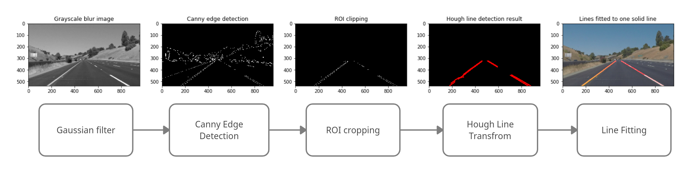

# **Finding Lane Lines on the Road**

Overview
---

  

This project tries to solve lane finding problem of self driving car using classical rule based computer vision approaches. 
Algorithm consists of following pipeline:

  

