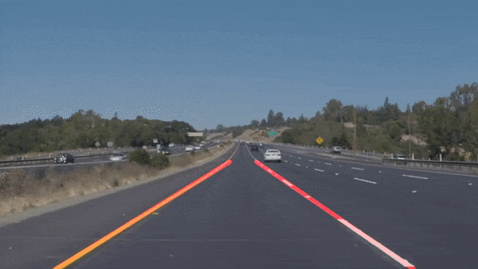

# **Finding Lane Lines on the Road**
[](http://www.udacity.com/drive)


## Overview

This project tries to find lane lines from RGB camera image using Hough Line Transform based algorithm.

<p align="center">
  
</p>

## Installation

The code is written in Python3 and Jupyter notebook. Number of Python3 libraries are used such as: **OpenCV** library for Computer Vision tasks, **Matplotlib** for visualizing results and **moviepy** for working with .mp4 video files. All the necessary packages can be installed by:

```
$ pip3 install -r requirements.txt
```

## Running

Main code is written in **P1.ipynb** file and it can be opened by Jupyter with following command:

```
$ jupyter-notebook P1.ipynb
```

Executing the cells of **P1.ipynb** will run the algorithm on images in **test_images** folder, videos in **test_videos** folder and display resulting lane lines by red line over the input image. Video outputs(Input video + Lane finding result) are saved in **outputs** folder.
