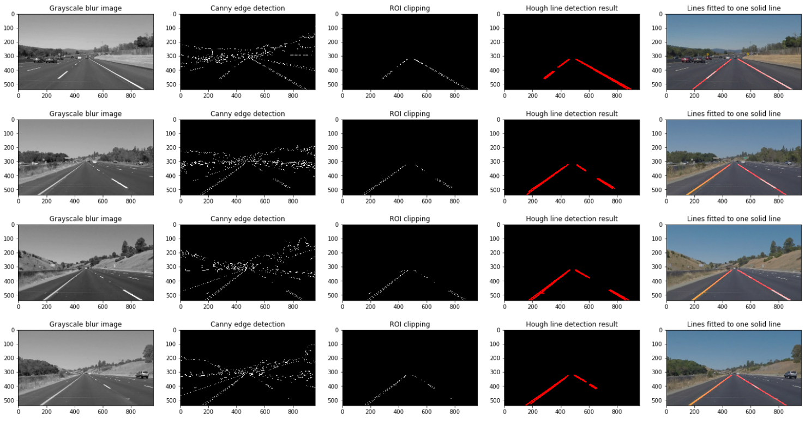

# Finding Lane Lines on the Road

### 1. Pipeline explanation

The pipeline consists of 5 steps.

1. In the first step, Lowpass Gaussian blur filter of kernel size 3 was applied to grayscale input image. This is a recommended step before applying Edge detection, due to its ability to remove small noises in the input image that could be considered as false edges.
2. Canny edge detection was applied to the blurred image. Parameter values for low and high threshold were selected as 50 and 150, which is found in previous exercise and seems to work well.
3. Select the ROI(Region of Interest) that approximately covers the ego lane of the car. Parameter values for ROI was also selected same as previous exercise and seems to work well with some tuning.
4. Hough transform algorithm is applied to extract line segments. Parameters are selected mostly similar to previous exercise as those values seems to be working well: **threshold** of 15, meaning at least 15 points in image space need to be associated with each line segment, **in_line_length** of 40 pixels, and **max_line_gap** of 20 pixels. 
5. Finally, **draw_lines()** function is called for rendering the output image. Originally just a drawing function, later it was modified in order to display each of left and right lane as a single solid line. To accomplish that following steps were taken:
    1. Horizontal lines were removed. Lines whose slope value falls in [-0.5, 0.5] were removed from the list of lines.
    2. Remaining lines were separated to left and right lane segments by its slope sign
    3. For each of the left and right line, line fitting and projection was performed. I tried two different methods:
        - Least Square Error: Each end points of the line segments were added to the list and fitted using LSE method. It was done using numpy's polyfit method
        - Median Line: For each of the line segments, its slope and bias (**m** and **b** of **y=m*x+b**) is calculated. Then output line segment is built using median slope and median bias values.

To try and see the result of changing parameter values easier, I made a plot of each step's output as shown in below image:

### 2. Shortcomings with the current pipeline

There are many situations in which my current pipeline doesn't take account. 
 - Almost all of test cases were taken during car was driving in straight line, thus lane markers are located in constant ROI and easily observed. If a car turns, switches lane or enters intersection, it is highly unlikely to work correct.
 - If car is in traffic jam and there is an another car too close, it might block camera's vision to some extent.
 - Since this pipeline only uses RGB camera data, it is susceptible to harsh weather that reduces visiblity and low lightning conditions. Even humans have hard time finding lanes in these conditions.

### 3. Possible improvements to the current pipeline

Possible improvements could be:
 - Filter lane line position in time domain(e.g: Moving average filter). Lane lines are likely to not change much between two consecutive frames.
 - Detect and track other cars in the lane. Other cars on the road, especially one driving in front of the car can give some information. With no visible lane marks, we usually rely on other cars' relative position for staying in proper position.
 - Combine other sensors' data such as LiDAR. So it is more robust to low lighting conditions and can also detect roadside objects.
 - Instead use Deep Learning based approaches that is trained on huge datasets, it can give much more accurate results. For example, it DL based approaches can be used for detecting cars or segmentation(pixelwise) for lane extraction.