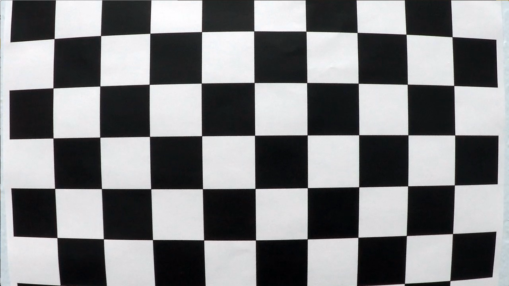
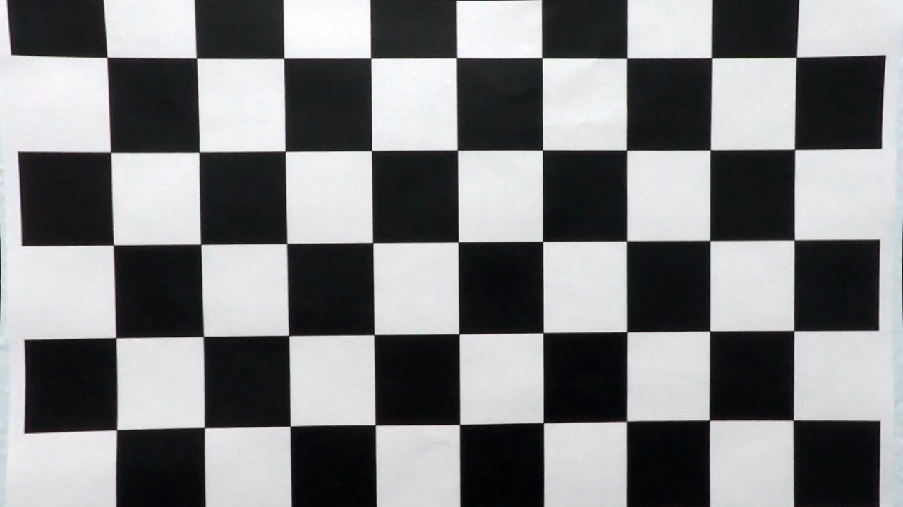

# Advanced Lane Finding
<!--
-->

In this project, a software pipeline to identify the lane boundaries in a video is implemented. 

## Result 

Track 1                       |  Track 2
:----------------------------:|:------------------------------:
[ <video src='project_video_output.mp4' width=600/> | <video src='challenge_video_output.mp4' width=600/>

## Camera Calibration

Raw camera images are often distorted by barrel or pincushion distortion due to imperfection of the optical systems of the camera. However if we have precise knowledge of camera's image sensor parameters and lens parameters, we can find the error caused by the lens distortion and compensate it to find undistorted image. Process of finding image sensor and lens parameters is called camera calibration and it is integral part of every computer vision system.

One of the most commonly used camera calibration algorithm is Zhang's method which uses printed pattern with known geometry. OpenCV uses Zhang's method in its `calibrateCamera()` function. It is used in [camera_calibration.py](camera_calibration/camera_calibration.py) file and it's result is saved to [camera_intrinsics.pkl](camera_calibration/camera_intrinsics.pkl). Using camera calibration result undistorting is tested in [camera_calibration.ipynb](camera_calibration/camera_calibration.ipynb)

Raw distorted image           |  Undistorted image
:----------------------------:|:------------------------------:
[  | 

## Pipeline 

System has following steps

###
---

The goals / steps of this project are the following:

* Compute the camera calibration matrix and distortion coefficients given a set of chessboard images.
* Apply a distortion correction to raw images.
* Use color transforms, gradients, etc., to create a thresholded binary image.
* Apply a perspective transform to rectify binary image ("birds-eye view").
* Detect lane pixels and fit to find the lane boundary.
* Determine the curvature of the lane and vehicle position with respect to center.
* Warp the detected lane boundaries back onto the original image.
* Output visual display of the lane boundaries and numerical estimation of lane curvature and vehicle position.

The images for camera calibration are stored in the folder called `camera_cal`.  The images in `test_images` are for testing your pipeline on single frames.  If you want to extract more test images from the videos, you can simply use an image writing method like `cv2.imwrite()`, i.e., you can read the video in frame by frame as usual, and for frames you want to save for later you can write to an image file.  

To help the reviewer examine your work, please save examples of the output from each stage of your pipeline in the folder called `output_images`, and include a description in your writeup for the project of what each image shows.    The video called `project_video.mp4` is the video your pipeline should work well on.  

The `challenge_video.mp4` video is an extra (and optional) challenge for you if you want to test your pipeline under somewhat trickier conditions.  The `harder_challenge.mp4` video is another optional challenge and is brutal!

If you're feeling ambitious (again, totally optional though), don't stop there!  We encourage you to go out and take video of your own, calibrate your camera and show us how you would implement this project from scratch!

## How to write a README
A well written README file can enhance your project and portfolio.  Develop your abilities to create professional README files by completing [this free course](https://www.udacity.com/course/writing-readmes--ud777).

