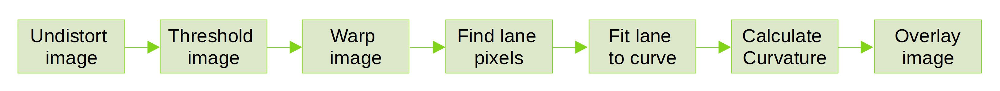
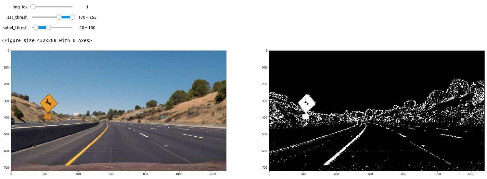
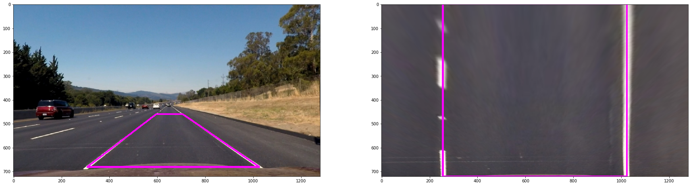
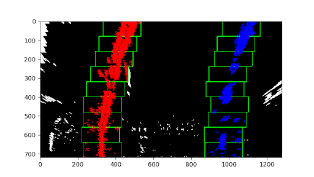
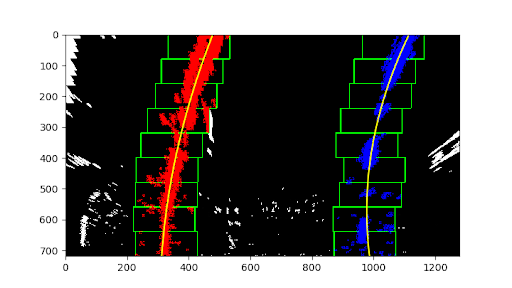

# Advanced Lane Finding
<!--
-->

In this project, a software pipeline to identify the lane boundaries in a video is implemented. 

## Result 

Track 1                       |  Track 2
:----------------------------:|:------------------------------:
[<video src='project_video_output.mp4' width=600/> | <video src='challenge_video_output.mp4' width=600/>

## Camera Calibration

Raw camera images are often distorted by barrel or pincushion distortion due to imperfection of the optical systems of the camera. However if we have precise knowledge of camera's image sensor parameters and lens parameters, we can find the error caused by the lens distortion and compensate it to find undistorted image. Process of finding image sensor and lens parameters is called camera calibration and it is integral part of every computer vision system.

One of the most commonly used camera calibration algorithm is Zhang's method which uses printed pattern with known geometry. OpenCV uses Zhang's method in its `calibrateCamera()` function. It is used in [camera_calibration.py](camera_calibration/camera_calibration.py) file and it's resulting parameters are saved to [camera_intrinsics.pkl](camera_calibration/camera_intrinsics.pkl). Using camera calibration result undistorting is tested in [camera_calibration.ipynb](camera_calibration/camera_calibration.ipynb)

Raw distorted image           |  Undistorted image
:----------------------------:|:------------------------------:
 | 

## Pipeline 

System pipeline consists of following steps as shown in below image

Each of the steps is explained in next sections 

### Thresholding

Thresholding tries to find lane marking pixel by using color component and edge gradient information. Lane markings are always painted with white or yellow color. These colors can be separated from the rest of the road by thresholding Saturation channel of HSL color scheme. Also, since those lane markings are drawn in parallel to car's moving direction, its edge should be detected by edge detection. Sobel filtering in x direction is used. To get good binary image representing lane markings, tuning is done using interactive widgets in separate Jupyter notebook [color_and_gradient.ipynb](color_and_gradient.ipynb)

### Warping

To calculate curvature of the road and other navigational tasks, it is important for the self driving road to view its location and condition of the road from bird eye(top) view. Thus we need to warp the image taken from camera perspective to bird eye view. For this OpenCV's getPerspectiveTransform() and warpPerspective() functions. Finding warp parameter/points is done by checking whether straight road line markings are becoming parallel lines in bird eye view. For that we need 4 points belonging to lane marking on original image that should become parallel when seen from the top. Once we have the points in original images, and its supposed position in warped image, we can use OpenCV's getPerspectiveTransform() function to calculate 3x3 Transformation Matrix M.  Transformation Matrix is then used by warpPerspective() function to warp entier image to top-down view.

Functions to find warp parameters and applying it to image are written in [warp_perspective.py](warp_perspective/warp_perspective.py) file. Tuning warp parameters is done interactively in [warp_perspective.ipynb](warp_perspective/warp_perspective.ipynb) file. Resulting parameters are saved in [warp_perspective.pkl](warp_perspective/perspective.pkl) file.

### Finding Lane Pixels

After undistorting, thresholding and warping, output binary image should have mostly lane markings. But we still need to find out which pixels are part of the left and right line. Approach used here is same as the sliding window approach offered in Udacity's Advanced Computer Vision lesson. We first split the histogram of x coordinates of the binary image pixels to find initial location of the left and right lane. Then we set up sliding windows to iterate across the binary activations in the image. 

### Fit curve
Once we found out which pixels belong to lanes, we use Numpy's polyfit() function to fit lane pixels to second order polynomial. Resulting parameters are then used for calculating lane curvature.

