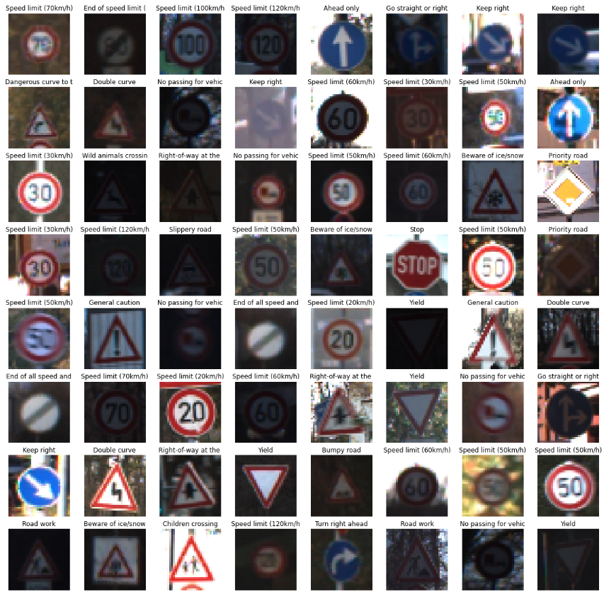
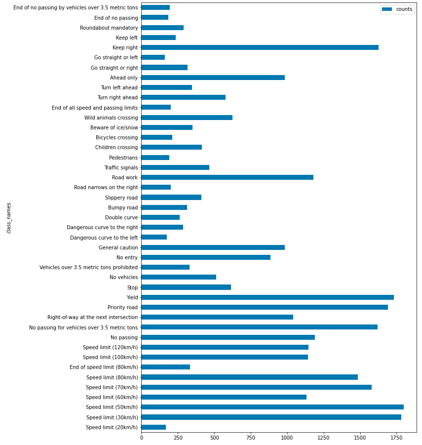
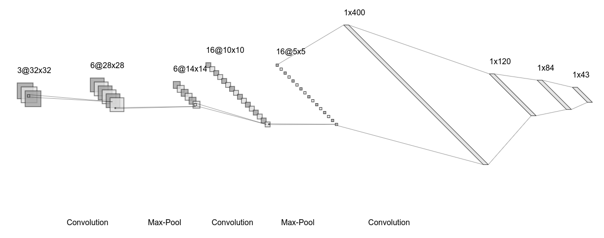
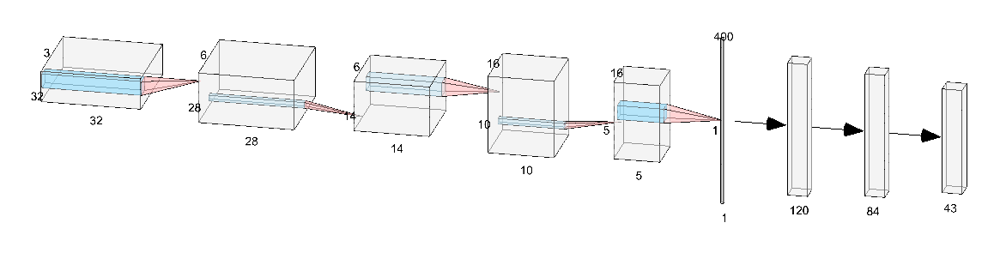
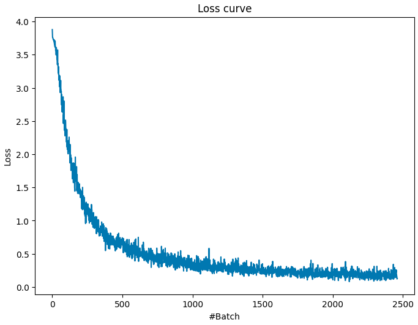
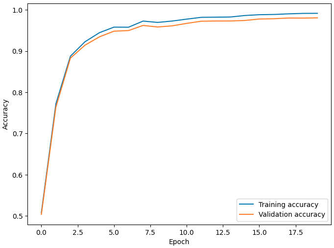
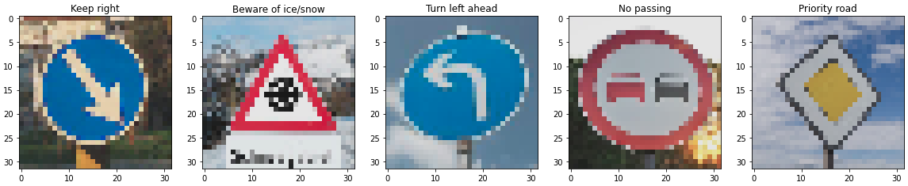
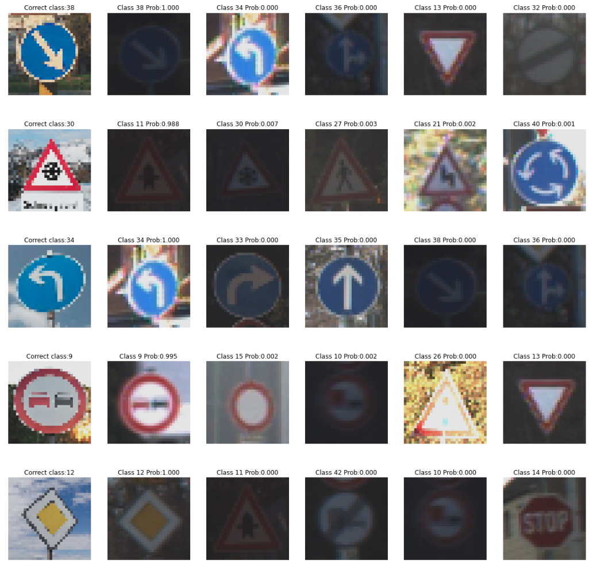

# Project: Build a Traffic Sign Recognition Program

Overview
---
In this project, we will build DNN inspired by LeNet to classify traffic sign images. After training model will be tested on some German traffic signs that is found on the web.

The Project
---
The goals / steps of this project are the following:
* Load the data set
* Explore, summarize and visualize the data set
* Design, train and test a model architecture
* Use the model to make predictions on new images
* Analyze the softmax probabilities of the new images
* Summarize the results with a written report

## Dataset Exploration

### Dataset Summary

We use German Traffic Sign Dataset named [GTSDB](https://benchmark.ini.rub.de/gtsrb_dataset.html) which consists of:  
 - Training set: 39209 images
 - Testing set:  12630 images
 - Number of classes: 43

Training set is further divided into train/validation split of 80/20:
 - Training set:  31367 images
 - Validation set: 7842 images

Original dataset images had various image sizes. However it was resized and saved into pickle format for convenience.
The pickled data is a dictionary with 4 key/value pairs:

 - 'features' is a 4D array containing raw pixel data of the traffic sign images, (num examples, width, height, channels).
 - 'labels' is a 1D array containing the label/class id of the traffic sign. The file signnames.csv contains id -> name mappings for each id.
 - 'sizes' is a list containing tuples, (width, height) representing the original width and height the image.
 - 'coords' is a list containing tuples, (x1, y1, x2, y2) representing coordinates of a bounding box around the sign in the image. THESE COORDINATES ASSUME THE ORIGINAL IMAGE. THE PICKLED DATA CONTAINS RESIZED VERSIONS (32 by 32) OF THESE IMAGES

 ### Exploratory Visualization

Some of the dataset images with labels are shown below:

Traffic sign dataset is imbalanced: Some classes have as little as ~200 data while other classes have almost 2000 sample images in the dataset.

Histogram of the dataset is shown below:

## Design and Test a Model Architecture

### Preprocessing

In contrast to MNIST dataset, Traffic Sign dataset has RGB images and it is easy to notice that color is important feature for classifying. 

Thus images will not be converted to grayscale, instead our neural network input will have 3 channel.

In the preprocessing step, dataset is:
 - Resized to fit input to Neural Network
 - Converted to floating type
 - Normailzed with Min-Max scaling to a range of [0.1, 0.9]
 - Shuffled

 To fit NN input data size and type, input image should be converted.

 Min-Max scaling was used for numerical stability and to prevent vanishing gradient problem happening. As network becomes deeper, it becomes easy for calculated values to get either too large or too small in the forward propagtion and produce not much gradients in back propagation. One way to address this issue is to normalize input images with Min-Max scaling in the preprocessing(Used in LeNet, choice of activation layer and batch normalization also tackles vanishing gradient). 

 Finally shuffling was also done during training to ensure that order of the data doesn't affect model's training.

### Model architecture:

It has 3 Convolution layers (Depth of 6, 16 and 400 each):
 - 5x5 kernel
 - No stride
 - RELU activation

First 2 Convolution layers are followed by 2x2 Max-pooling layers.

Followed by 3 Fully Connected layers (Depth of 120, 84 and 43 each):
 - Dropout of 0.5
 - RELU activation

 Finally output class probability is calculated by Softmax layer.

Model architecture shown in LeNET style:

Model architecture shown in AlexNet style:

Above model architecture images were created by [NN-SVG](http://alexlenail.me/NN-SVG/LeNet.html) tool.

### Model training:

Model was trained with following hyper parameters:
 - Loss function: Softmax Cross Entropy
 - Optimizer: Adam
 - Learning rate: 0.001
 - Mini-batch size: 256
 - Number of epoch: 20

Loss curve is shown below:

Training and validation accuracy is shown below:

Final accuracy:
 - Training:   0.991
 - Validation: 0.980
 - Test:       0.937

### Solution approach

First, original LeNet model was tried with only input modified to read Traffic Sign dataset. However training result was not satisfactory. 
Both training and validation set accuracy stopped increasing after ~20 epochs indicating possible underfitting and model too small/shallow. 
Following steps were taken to solve underfitting issue:
 - Use 3 layers of RGB image instead of grayscale like in LeNet and MNIST
 - Add one more convolution layer with enough depth (400)

Once underfitting issue was considered solved (Training accuracy keep increasing for more epochs), validation accuracy was not as high as training accuracy suggesting overfitting starting to appear. To prevent this, dropout of 0.5 probability was added to each of Fully Connected layers.

## Test a Model on New Images

### Acquiring New Images

5 images German Traffic Sign images from Google search were cropped, resized and preprocessed to test on newly trained model. Images have different backgrounds and taken from various distance and angle. Images are placed in assets folder with names: german_sign#.png

Traffic Sign images found from Google Search:

### Performance New Images & Model certainty

Out of 5 new images, model was able to correctly classify 4 of them (80% accuracy).

In the below image, first column displays input new images, for columns 2-6: Title says what was the predicted class and its probability.

Second image was wrongly classified: 
 - Correct class 30: Beware of ice/snow
 - Top prediction(Probability: 0.98773) Class 11: Right-of-way at the next intersection
 - 2nd prediction(Probability: 0.00662) Class 30: Beware of ice/snow
 - 3rd prediction(Probability: 0.00250) Class 27: Pedestrians

Although top prediciton was wrong(Right-of-way at the next intersection), Correct class had 2nd highest probability. But at this low resolution it seems hard to correctly classify even for humans. Top 4 predictions all had similar features: Triangle shape, White background, Red colored corner, Some black shape drawn in the center. 

Rest of the 4 images were correctly classified. However similar shapes were in Top K predictions as shown in above figure. Both 1st and 3rd images(Keep right and Turn left ahead) were round shaped with blue background, white edges, some kind of white arrow shape in the center. In all cases, top predicions mostly included Traffic Signs which has same shape, background color, edge color and symbols. Based on this we can say model learned to look at correct features. 

