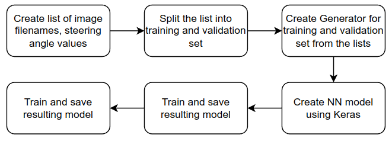
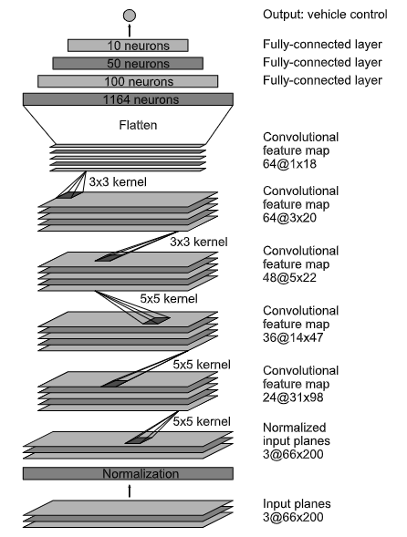
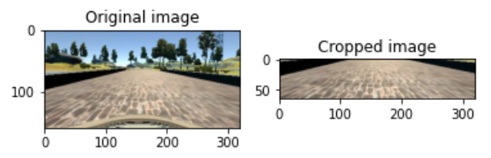
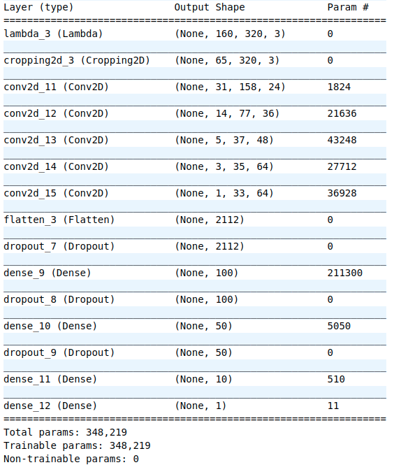
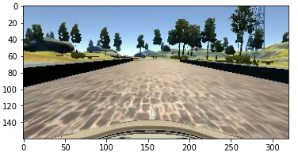
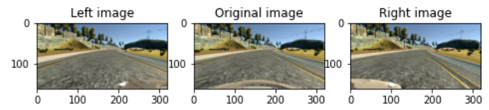
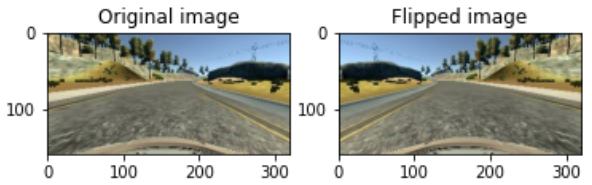
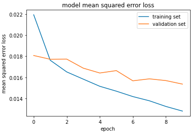

# **Behavioral Cloning** 

---

**Behavioral Cloning Project**

The goals / steps of this project are the following:
* Use the simulator to collect data of good driving behavior
* Build, a convolution neural network in Keras that predicts steering angles from images
* Train and validate the model with a training and validation set
* Test that the model successfully drives around track one without leaving the road
* Summarize the results with a written report


[//]: # (Image References)

[image1]: ./examples/placeholder.png "Model Visualization"
[image2]: ./examples/placeholder.png "Grayscaling"
[image3]: ./examples/placeholder_small.png "Recovery Image"
[image4]: ./examples/placeholder_small.png "Recovery Image"
[image5]: ./examples/placeholder_small.png "Recovery Image"
[image6]: ./examples/placeholder_small.png "Normal Image"
[image7]: ./examples/placeholder_small.png "Flipped Image"

## Rubric Points
### Here I will consider the [rubric points](https://review.udacity.com/#!/rubrics/432/view) individually and describe how I addressed each point in my implementation.  

---
### Files Submitted & Code Quality

#### 1. Submission includes all required files and can be used to run the simulator in autonomous mode

My project includes the following files:
* [model.py](model.py) containing the script to create and train the model
* [drive.py](drive.py) for driving the car in autonomous mode
* [model.h5](model.h5) containing a trained convolution neural network using Keras library
* [video.mp4](video.mp4) A video recording of trained model driving the vehicle autonomously for one lap around the track.
* [README.md](README.md)(this file) for summarizing the results (based on writeup_template.md)

#### 2. Submission includes functional code
Using the Udacity provided simulator and my drive.py file, the car can be driven autonomously around the track by executing 
```sh
python drive.py model.h5
```

The model provided in [model.py](model.py) file, has [generator]](https://github.com/Zulkhuu/self-driving-car/blob/0e30a0e8ed70727150251fe63c518ef55494fd90/P4_behavorial_cloning/model.py#L79) function for creating generator for creating mini-batches. The function is initialized with list of image filenames and corresponding steering angle values from recorded data. Image files are loaded and augmented(Horizontal flip) only when next batch is called during training.

#### 3. Submission code is usable and readable

The model.py file contains the code for training and saving the convolution neural network. The below image shows the pipeline I used for training the model.



 - First a list of image filenames and corresponding steering angles are created. Different session of recordings are recorded in different folders. For each folder, [read_data](https://github.com/Zulkhuu/self-driving-car/blob/f622667666cc74d08b757dcb82f386d70930864b/P4_behavorial_cloning/model.py#L25) function is called with directory name and steering correction as a parameter. Steering correction is needed because left and right camera images are also added to the list in this function (Steering correction of 0.2 was added/subtracted to center steering angle in my case)

  - The list created in previous step is then split into training and validation set using Scikit's train_test_split function. Validation set is comprised of 20% of data.

  - Generator is then created for both training and validation set using [generator](https://github.com/Zulkhuu/self-driving-car/blob/f622667666cc74d08b757dcb82f386d70930864b/P4_behavorial_cloning/model.py#L79) function. Generators are used because of its memory efficiency. The Generator is initialized with full list of filenames and steering angle values only. Loading images and augmenting(Horizontal flip) is only done on current mini-batches.

  - Next, Deep Neural Network Model is created using Keras library. Detailed info is next chapter.

  - Created model is then trained/validated using previously created generators.

  - Trained model is saved as .h5 file and later used for running simulation autonomously.

  - Training/Validation Loss is plotted from training history object. It's useful for evaluating if current model is under/over-fitting and needs change.

### Model Architecture and Training Strategy

#### 1. An appropriate model architecture has been employed

My model is based on Nvidia's [End to End Learning for Self-Driving Cars](https://arxiv.org/abs/1604.07316) paper. Original model architecture from the paper is shown in below image. 



In my model, there are few subtle differences from original model:
 - Original input image size of 160x320 is cropped to 65x320. 70 rows from top and 25 rows from bottom of the image is cropped as these rows doesn't include useful information. Cropping has significant impact on training speed(image size is more than halved). Original and cropped image is shown below



 - Dropout layer of 0.5 probability is inserted between fully connected layers in order to generalize/reduce overfitting.


Full modified model architecture is explained in later [Final Model Architecture](#final-model-architecture) chapter

#### 2. Attempts to reduce overfitting in the model

 * The model contains dropout layers in order to reduce overfitting (model.py lines starting from [L140](https://github.com/Zulkhuu/self-driving-car/blob/0e30a0e8ed70727150251fe63c518ef55494fd90/P4_behavorial_cloning/model.py#L140)). 

 * The model was trained and validated on different data sets to ensure that the model was not overfitting (model.py line [L75](https://github.com/Zulkhuu/self-driving-car/blob/0e30a0e8ed70727150251fe63c518ef55494fd90/P4_behavorial_cloning/model.py#L75)). Final model was trained on 2 different dataset(recorded sessions): one containing only driving in the center of the lane, another one containing additional data in hard turn. 
 
 * The training dataset was augmented in two ways:
    - Add Left and Right Camera images to the training dataset. Corresponding steering angle values are set by adding/subtracting fixed value to original steering angle value.
    - Generator function also adds flipped image to the training data. Original image is flipped horizontally and corresponding steering angle sign is reversed.

#### 3. Model parameter tuning

 - Input image is normalized to the range of [-1, 1].

 - Cropping layer removes 70 rows from top(mostly sky and tree), 25 rows from the bottom(car horn).

 - The model used an adam optimizer, so the learning rate was not tuned manually (model.py line [L149](https://github.com/Zulkhuu/self-driving-car/blob/0e30a0e8ed70727150251fe63c518ef55494fd90/P4_behavorial_cloning/model.py#L149)).

 - Model uses Mean Squared Error (Common choice for regression)

#### 4. Appropriate training data

Training data was chosen to keep the vehicle driving on the road. I used a combination of center lane driving, recovering from sides of the road and hard turns.

For details about how I created the training data, see the next section. 

### Model Architecture and Training Strategy

#### 1. Solution Design Approach

As instructed, I started with single fully connected layer only model in order to check if reading data and training pipeline was working. 

In order to gauge how well the model was working, I split my image and steering angle data into a training and validation set. I found that my first model had a high MSE error on both training and validation set as predicted. This implied that the model was underfitting. 

Next step was to use a deeper convolution neural network model based on Nvidia's model. I thought this model might be appropriate because it has proven to work even in real world scenario. This model had lower training error, but still had high validation loss which indicated overfitting. When using trained model to drive vehicle in the simulation, it was able to stay in the center for a while. However once car got drifted from the center, it was not good at recovering back to the center of the lane. 

To combat these issues, First I added Left and Right camera images to the training data. I also modified the model to include Dropout layer of 0.5 probability after Flatten layer. These steps slightly decreased the validation loss and significantly improved the cars autonomous driving behavour in the simulator.

However there were a few spots where the vehicle almost fell off the track. To further improve these issues, I recorded additional data where the vehicle had difficulty staying in the center of the lane and added to the data. To increase generalization, I further added 2 Dropout layers between fully connected layers.

At the end of the process, the vehicle was able to drive autonomously around the track without leaving the road.

#### 2. Final Model Architecture

The final model architecture (model.py [L131](https://github.com/Zulkhuu/self-driving-car/blob/0e30a0e8ed70727150251fe63c518ef55494fd90/P4_behavorial_cloning/model.py#L131)) consisted of a convolution neural network with the following layers and layer sizes shown in below image:




#### 3. Creation of the Training Set & Training Process

To capture good driving behavior, I first used 3 laps of data on track one for both direction using center lane driving. Here is an example image of center lane driving:



To help vehicle recover to center when it is drifted away, I added left and right camera image with steering angle correction. Here is an example of left, central and right camera images. (Corresponding steering angle of 0.2/0.0/-0.2) 



To augment the dataset, I also flipped images and angles. Here is an example of an image that has then been flipped:



After the collection and augmentation process, I had around ~50000 number of data points. I then preprocessed this data by normalizing into range of [-1, 1] and cropped to 65x320 size to include only necessary image parts.

I finally randomly shuffled the data set and put 20% of the data into a validation set. 

I used this training data for training the model. The validation set helped determine if the model was over or under fitting. The ideal number of epochs was 10 as further training didn't improve validation loss. Final training/validation loss plot is shown below



I used an adam optimizer so that manually training the learning rate wasn't necessary.