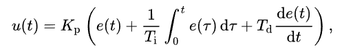
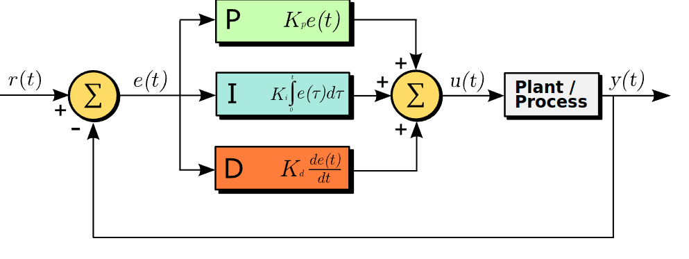
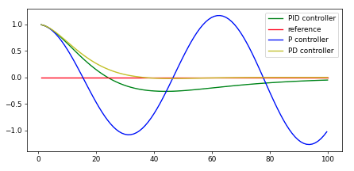
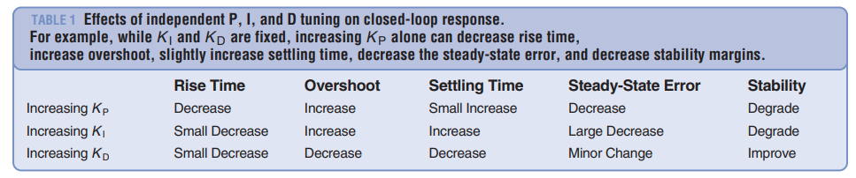

# CarND-Controls-PID
Self-Driving Car Engineer Nanodegree Program

---

## Dependencies

* cmake >= 3.5
 * All OSes: [click here for installation instructions](https://cmake.org/install/)
* make >= 4.1(mac, linux), 3.81(Windows)
  * Linux: make is installed by default on most Linux distros
  * Mac: [install Xcode command line tools to get make](https://developer.apple.com/xcode/features/)
  * Windows: [Click here for installation instructions](http://gnuwin32.sourceforge.net/packages/make.htm)
* gcc/g++ >= 5.4
  * Linux: gcc / g++ is installed by default on most Linux distros
  * Mac: same deal as make - [install Xcode command line tools]((https://developer.apple.com/xcode/features/)
  * Windows: recommend using [MinGW](http://www.mingw.org/)
* [uWebSockets](https://github.com/uWebSockets/uWebSockets)
  * Run either `./install-mac.sh` or `./install-ubuntu.sh`.
  * If you install from source, checkout to commit `e94b6e1`, i.e.
    ```
    git clone https://github.com/uWebSockets/uWebSockets 
    cd uWebSockets
    git checkout e94b6e1
    ```
    Some function signatures have changed in v0.14.x. See [this PR](https://github.com/udacity/CarND-MPC-Project/pull/3) for more details.
* Simulator. You can download these from the [project intro page](https://github.com/udacity/self-driving-car-sim/releases) in the classroom.

Fellow students have put together a guide to Windows set-up for the project [here](https://s3-us-west-1.amazonaws.com/udacity-selfdrivingcar/files/Kidnapped_Vehicle_Windows_Setup.pdf) if the environment you have set up for the Sensor Fusion projects does not work for this project. There's also an experimental patch for windows in this [PR](https://github.com/udacity/CarND-PID-Control-Project/pull/3).

## Basic Build Instructions

1. Clone this repo.
2. Make a build directory: `mkdir build && cd build`
3. Compile: `cmake .. && make`
4. Run it: `./pid`. 

Tips for setting up your environment can be found [here](https://classroom.udacity.com/nanodegrees/nd013/parts/40f38239-66b6-46ec-ae68-03afd8a601c8/modules/0949fca6-b379-42af-a919-ee50aa304e6a/lessons/f758c44c-5e40-4e01-93b5-1a82aa4e044f/concepts/23d376c7-0195-4276-bdf0-e02f1f3c665d)

## Reflection

### PID Controller

The PID controller is a widely used closed loop control algorithm that takes 3 parameters: Proportional, Integral and Differential. 

Its formula is shown in below image



where:
 - $u(t)$:  PID control variable
 - $K_{p}$	=	proportional gain
 - $e(t)$	=	error value
 - $K_{i}$	=	integral gain
 - ${de}$	=	change in error value
 - ${dt}$	=	change in time

It can be also shown as block diagram in below image (Image taken from [wikipedia](https://upload.wikimedia.org/wikipedia/commons/4/43/PID_en.svg)):



#### Parameters

 - Proportional or **P** term is directly proportional to error value. Higher the **P** gain, controller approaches set/target value faster, but it tends to overshoot target value and oscillates. In case of driving car in lane, overshooting results in driving in zig zag line. On th other hand, too low **P** value, results in slow reaction and car might not make a hard turn in time.
 - Differential or **D** term is directly proportional to the change in error value. Thus it prevents overshoot created by **P** control by dampening the overall system. While too small value might be not enough to cancel overshooting, too large value also decreases overall reaction speed of the system.  Combined with proportional control, **PD** control works very well in ideal case. 
 - Integral or **I** term is directly proportional to the sum of the error values. Thus it prevents any systematic bias in the system. In case of the driving car in the center of the lane, Steering drift in steering angle or slippery road surfaces can result in steady state error which **PD** controller cannot take care of. While too small **I** gain might be too slow to remove steady state error, large value can also reduce system stability and result in overshoot.

**P**, **PD** and **PID** controller's output plot from the class shown below is a good example for displaying each controller's behavior.



 ### Tuning

First I tried **P** only control by setting **I** and **D** gains to zero. Result was zig zagging(overshooting) vehicle  as expected:


Then, I tried **PD** controller(Leaving **I** to zero). I tuned the **P** and **D** parameters manually by observing car's driving behavior. 
I found the below table from IEEE article to be particularly helpful. [Link](http://eprints.gla.ac.uk/3815/1/IEEE_CS_PID_01580152.pdf)



Table columns can be described in car's driving behavior as:
 - Rise time slow: Car is slow to respond when there is an error or curvy road or turn. 
 - Overshoot happens: Car is driving in zig-zag line
 - Settling time slow: Car is slow to recenter and move straight(without overshoot)
 - Steady state error: Car is driving not in the center of the lane

 By manually tuning, I found $K_p=0.2$ and $K_d=2.0$ to be good values. With these values, Car was able to finish a lap without leaving the drivable portion of the track. Recorded video of **PD** controller can be found in [pd_full_lap.mp4](assets/pd_full_lap.mp4) video file.

 The car was driving well, but it seemed like car is driving little to the right and it had some difficulty in hard left turn after passing the bridge.

 Finally I tried full **PID** controller by setting $K_I=0.004$ value(same as in classroom). Adding **I** term seemed to improved the steady state error and overall stability of the driving a little bit. Recorded video of **PID** controller can be found in [pid_full_lap.mp4](assets/pid_full_lap.mp4) video file.


